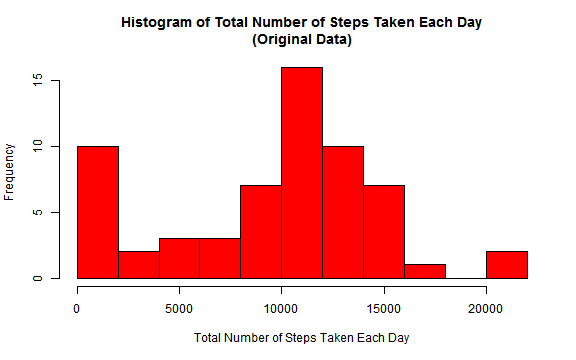
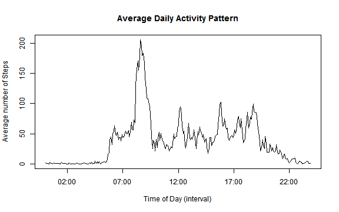
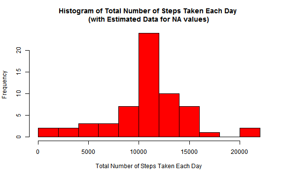
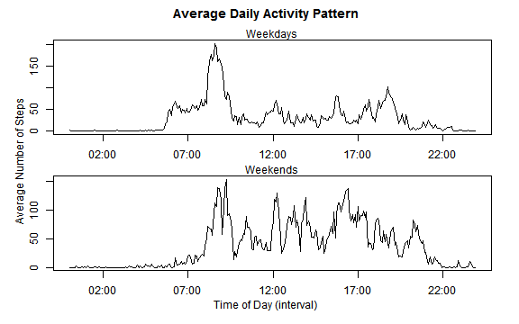

# Reproducible Research: Peer Assessment 1
By lt80595@gmail.com


## Loading and preprocessing the data
Here I load the data:  

```r
mydata <- read.csv("activity.csv")
```
I choose not to preprocess the data and remove the NA values as this would be addressed later in the assignment.

## What is mean total number of steps taken per day?
First I created a dataframe, "df", with the total number of steps taken per day.  

```r
dailySteps <- by(mydata$steps, mydata$date, sum, na.rm = TRUE)
a <- levels(mydata$date)
df <- data.frame(Date = a, Steps = as.numeric(dailySteps))
```
Then I plotted a histogram of the data.  

```r
xlab <- "Total Number of Steps Taken Each Day"
ylab <- "Frequency"
main <- "Histogram of Total Number of Steps Taken Each Day
(Original Data)"
hist(df$Steps, breaks = 15, main = main, xlab = xlab, ylab = ylab, 
     col = 'red')
```

 

Then I calculated the mean and median total number of steps taken per day:  

```r
options(scipen=999)
mn <- round(mean(df$Steps))
md <- median(df$Steps)
```
The mean total number of steps taken per day is 9354.  
The median total number of steps taken per day is 10395.  

## What is the average daily activity pattern?
In order to find the average daily activity pattern I had to use the function strptime() to change the time intervals from discrete numeric values to POSIX values and stored the results in a data frame "activity_df" along with the average step values according to 5-minute intervals.

```r
activity <- by(mydata$steps, mydata$interval, mean, na.rm = TRUE)
l <- sprintf("%04d", mydata$interval[1:length(activity)])
intervalLevels <- strptime(l, "%H%M")
activity_df <- data.frame(Interval = intervalLevels, 
                          Steps = as.numeric(activity))
```
I then plotted the average number of steps by the 5-minute intervals.

```r
xlab2 <- "Time of Day (interval)"
ylab2 <- "Average number of Steps"
main2 <- "Average Daily Activity Pattern"
plot(activity_df$Interval, activity_df$Steps, xlab = xlab2,
     ylab = ylab2, main = main2, type = "l")
```

 

What is the 5-minute interval, on average accross all days, containing the maximum number of steps?  

```r
m <- max(activity_df$Steps)
mx <- subset(activity_df$Interval, activity_df$Steps == m)
mx <- format(mx, "%H:%M")
```
The 5-minute interval with the maximum averaged number of steps begins at 08:35.
## Inputing missing values
First, lets see how many missing values there are in the data:

```r
b <- sum(!complete.cases(mydata))
```
There are 2304 missing values in the dataset.  
  
I chose to fill in these missing values using the average mean over all days for that 5-minute interval. First I created a data frame, "meanSteps_df", that is the same size of "mydata", where average daily steps is repeated for each 5-minute interval.

```r
meanSteps_df <- data.frame(Interval = mydata$interval, 
                           Steps = as.numeric(activity))
```
Next, I created another data frame, named "new_mydata", that closely matches the original data frame, "mydata", except I filled in the missing values using a for loop.

```r
new_mydata <- data.frame(Steps = mydata$steps, Date = mydata$date, 
                         Interval = mydata$interval)

for(i in 1:nrow(mydata)){
  
      if(is.na(mydata$steps[i])){
           new_mydata$Steps[i] <- meanSteps_df$Steps[i]   
           
      }else{
           new_mydata$Steps[i] <- mydata$steps[i]
           
      }
}
```
We can double check this by looking at the beginning of each data frame and noting the different Step values.

```r
head(mydata)
head(new_mydata)
```
<!-- html table generated in R 3.1.0 by xtable 1.7-3 package -->
<!-- Sun Jun 15 13:44:34 2014 -->
<TABLE border=1>
<TR> <TH>  </TH> <TH> steps </TH> <TH> date </TH> <TH> interval </TH>  </TR>
  <TR> <TD align="right"> 1 </TD> <TD align="right">  </TD> <TD> 2012-10-01 </TD> <TD align="right">   0 </TD> </TR>
  <TR> <TD align="right"> 2 </TD> <TD align="right">  </TD> <TD> 2012-10-01 </TD> <TD align="right">   5 </TD> </TR>
  <TR> <TD align="right"> 3 </TD> <TD align="right">  </TD> <TD> 2012-10-01 </TD> <TD align="right">  10 </TD> </TR>
  <TR> <TD align="right"> 4 </TD> <TD align="right">  </TD> <TD> 2012-10-01 </TD> <TD align="right">  15 </TD> </TR>
  <TR> <TD align="right"> 5 </TD> <TD align="right">  </TD> <TD> 2012-10-01 </TD> <TD align="right">  20 </TD> </TR>
  <TR> <TD align="right"> 6 </TD> <TD align="right">  </TD> <TD> 2012-10-01 </TD> <TD align="right">  25 </TD> </TR>
   </TABLE>
<!-- html table generated in R 3.1.0 by xtable 1.7-3 package -->
<!-- Sun Jun 15 13:44:34 2014 -->
<TABLE border=1>
<TR> <TH>  </TH> <TH> Steps </TH> <TH> Date </TH> <TH> Interval </TH>  </TR>
  <TR> <TD align="right"> 1 </TD> <TD align="right"> 1.72 </TD> <TD> 2012-10-01 </TD> <TD align="right">   0 </TD> </TR>
  <TR> <TD align="right"> 2 </TD> <TD align="right"> 0.34 </TD> <TD> 2012-10-01 </TD> <TD align="right">   5 </TD> </TR>
  <TR> <TD align="right"> 3 </TD> <TD align="right"> 0.13 </TD> <TD> 2012-10-01 </TD> <TD align="right">  10 </TD> </TR>
  <TR> <TD align="right"> 4 </TD> <TD align="right"> 0.15 </TD> <TD> 2012-10-01 </TD> <TD align="right">  15 </TD> </TR>
  <TR> <TD align="right"> 5 </TD> <TD align="right"> 0.08 </TD> <TD> 2012-10-01 </TD> <TD align="right">  20 </TD> </TR>
  <TR> <TD align="right"> 6 </TD> <TD align="right"> 2.09 </TD> <TD> 2012-10-01 </TD> <TD align="right">  25 </TD> </TR>
   </TABLE>
By changing the data set, our histogram of the number of steps will also change:

```r
dailySteps2 <- by(round(new_mydata$Steps), new_mydata$Date, sum)
a3 <- levels(new_mydata$Date)
df3 <- data.frame(Date = a3, Steps = as.numeric(dailySteps2))
```

```r
xlab3 <- "Total Number of Steps Taken Each Day"
ylab3 <- "Frequency"
main3 <- "Histogram of Total Number of Steps Taken Each Day 
(with Estimated Data for NA values)"
hist(df3$Steps, breaks = 15, main = main3, xlab = xlab3, ylab = ylab3, 
     col = 'red')
```

 

By looking at the histogram you can see that the NA values, which were previously treated as zeros, have increased the frequency of days where the number of steps were around the mean and median.  
Then, using the altered data set, I calculated the new mean and new median total number of steps taken per day:  

```r
options(scipen=999)
mn2 <- round(mean(df3$Steps))
md2 <- median(df3$Steps)
```
The new mean total number of steps taken per day is 10766.  
The new median total number of steps taken per day is 10762.

## Are there differences in activity patterns between weekdays and weekends?
To address the differences in activity patterns between weekdays and weekends, I first had to create a new data frame, "activity_df4", that had the same step data as the original data set "mydata", but where the NA step values were set to zeros and the dates are converted to days of the week using the weekdays() function.

```r
f <- c("Weekday", "Weekend")
datesCont <- mydata$date
timesCont <- sprintf("%04d", mydata$interval[1:length(activity)])
time_date <- paste(timesCont, datesCont)
intervalLevels4 <- strptime(time_date, format = "%H%M %Y-%m-%d")
wkdy <- weekdays(intervalLevels4)

for(i in 1:nrow(mydata)){
      if(is.na(mydata$steps[i])){
           mydata$steps[i] <- 0   
      }
}

activity_df4 <- data.frame(Interval = intervalLevels4, 
                          Steps = as.numeric(mydata$steps), Day = wkdy)
```
I then used a for loop to add a new column labeling the days of the week as either weekdays or weekends.

```r
DayEnd <- c()
for(i in 1:nrow(activity_df4)){

      if(activity_df4$Day[i] == "Monday"){
           activity_df4$DayEnd[i] <- f[1]   

      }else if(activity_df4$Day[i] == "Tuesday"){
           activity_df4$DayEnd[i] <- f[1]

      }else if(activity_df4$Day[i] == "Wednesday"){
        activity_df4$DayEnd[i] <- f[1]

      }else if(activity_df4$Day[i] == "Thursday"){
        activity_df4$DayEnd[i] <- f[1]

      }else if(activity_df4$Day[i] == "Friday"){
        activity_df4$DayEnd[i] <- f[1]

      }else if(activity_df4$Day[i] == "Saturday"){
        activity_df4$DayEnd[i] <- f[2]

      }else if(activity_df4$Day[i] == "Sunday"){
        activity_df4$DayEnd[i] <- f[2]
      }
}

activity_df4$Interval <- strptime(time_date, format = "%H%M")
```
Then I used ddply in the plyr package to split the dataframe by 5-minute interval and either Weekdays or Weekends and then find the average daily activity pattern.

```r
library(plyr)
s <- ddply(activity_df4, .(Interval, DayEnd), summarize, mean = mean(Steps))
s2 <- subset(s, DayEnd == f[1])
s3 <- subset(s, DayEnd == f[2])
```
The final panel plot (using the base system) was made using the code below:

figure

```r
xlab4 <- "Time of Day (interval)"
ylab4 <- "Average number of Steps"
main4 <- "Average Activity Pattern by Weekday or Weekend"
par(mfcol= c(2,1), oma = c(2, 2,2, 1), mar = c(2,2,1,1)+0.1)
#Top Plot
plot(s2$Interval, s2$mean, type = "l")
mtext("Weekdays", side = 3)
#Bottom Plot
plot(s3$Interval, s3$mean, type = "l")
#Panel plot details
mtext("Weekends", side = 3)
title("Average Daily Activity Pattern", outer = TRUE)
mtext("Time of Day (interval)", side = 1, outer = TRUE)
mtext("Average Number of Steps", side = 2, outer = TRUE)
```

 
  
From the 2 plots you can see that, generally speaking, people wake later in the day on weekends, still take the most steps between 8:00 and 10:00 am, and seem to have more activity around dinner time (roughly 5:00 pm) than they do on the weekdays.
